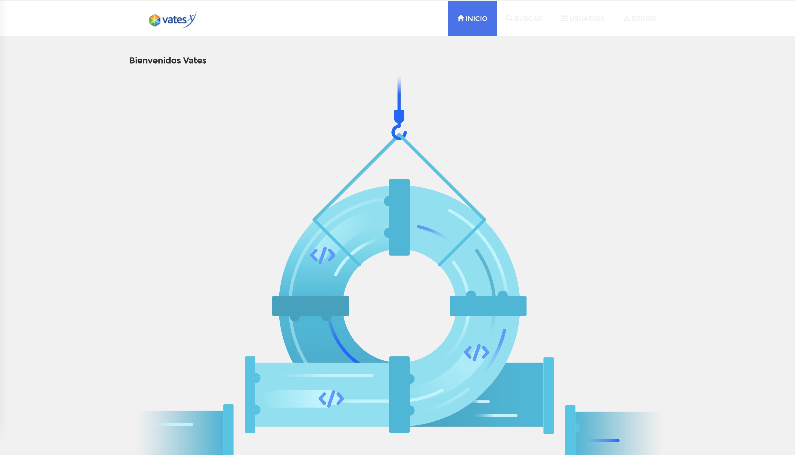

# Aplicación Spring Java de ejemplo.

## Comprendiendo la aplicación Spring-Pet a partir de unos pocos diagramas.
<a href="https://speakerdeck.com/michaelisvy/spring-petclinic-sample-application">Ver aquí la presentación</a>

## Ejecutar la aplicación de manera local
```
	git clone git@github.com:roxtrongo/web-app.git
	cd web-app
	./mvnw spring-boot:run
    
```


```
mvn package
java -jar target/web-spring-demo-0.1.jar
```

java -XX:+UnlockCommercialFeatures -XX:+FlightRecorder -XX:StartFlightRecording=duration=60s,filename=myrecording.jfr MyApp

java -XX:+UnlockCommercialFeatures -XX:+FlightRecorder -XX:StartFlightRecording=duration=60s,filename=myrecording.jfr -jar web-spring-demo-0.1.jar

java -XX:+UnlockCommercialFeatures -XX:+FlightRecorder -XX:StartFlightRecording=duration=60s,filename=myrecording.jfr -jar target/web-spring-demo-0.1.jar


### Modificar JAVA_HOME

```
    rvaldes@MBP-de-Rodrigo  ~/Desarrollo/helidon-quickstart-se  /usr/libexec/java_home -V
    Matching Java Virtual Machines (4):
        14.0.1 (x86_64) "Oracle Corporation" - "OpenJDK 14.0.1" /Library/Java/JavaVirtualMachines/openjdk-14.0.1.jdk/Contents/Home
        11.0.7 (x86_64) "AdoptOpenJDK" - "AdoptOpenJDK 11" /Library/Java/JavaVirtualMachines/adoptopenjdk-11.jdk/Contents/Home
        1.8.271.09 (x86_64) "Oracle Corporation" - "Java" /Library/Internet Plug-Ins/JavaAppletPlugin.plugin/Contents/Home
        1.8.0_251 (x86_64) "Oracle Corporation" - "Java SE 8" /Library/Java/JavaVirtualMachines/jdk1.8.0_251.jdk/Contents/Home
    /Library/Java/JavaVirtualMachines/adoptopenjdk-11.jdk/Contents/Home

    ## Para JDK 11
    export JAVA_HOME=/Library/Java/JavaVirtualMachines/adoptopenjdk-11.jdk/Contents/Home

    ## Para JDK 8
    export JAVA_HOME=/Library/Java/JavaVirtualMachines/jdk1.8.0_251.jdk/Contents/Home

   
    
```


Luego se puede acceder a la aplicación en: http://localhost:18082/



## Publicar app en contenedor docker

```
docker build --tag web-app:1.0 .
docker run --publish 8000:18082 --detach --name web-app web-app:1.0
docker run --publish 8000:18082 --name web-app web-app:1.0
```

docker build --tag web-app-docker:1.0 .

docker run -ti f4775b438c36

docker run --publish 8000:18082 --name web-app web-app-docker:1.0


## Configuración de Base de Datos

La configuración por defecto, usa una base de datos en memoria (HSQLDB) la cual es poblada
con datos al  momento del arranque de la aplicación. 

En su configuración predeterminada, web-app utiliza una base de datos en memoria (HSQLDB) que
se llena al inicio con datos. Se proporciona una configuración similar para MySql en caso de que 
se necesite una configuración de base de datos persistente.
Tenga en cuenta que cada vez que se cambia el tipo de base de datos, el archivo data-access.properties 
debe actualizarse y el mysql-connector-java artefacto de pom.xml debe ser descomentada.

Puede iniciar una base de datos MySql con Docker:

```
docker run -e MYSQL_ROOT_PASSWORD=web-app -e MYSQL_DATABASE=web-app -p 3306:3306 mysql:5.7.8
```
